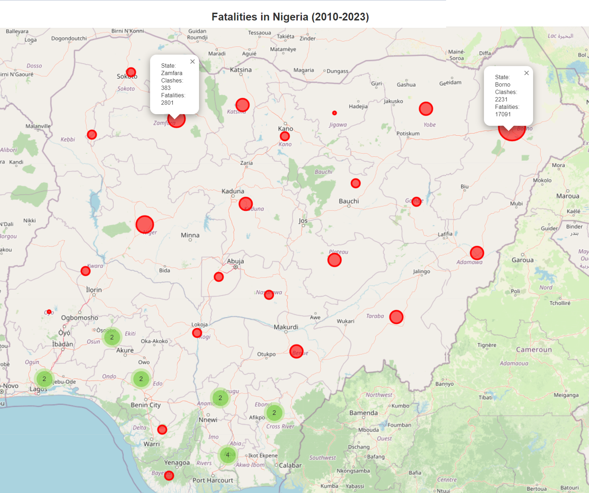

# Introduction
For more than a decade, Nigeria has been battling with armed clashes by non-state armed and insurgent groups (Boko Haram, Militia/Bandits etc.), especially in the northern part of the country, which has caused the deaths and displacement of people and destruction of towns. Two of the devastating events that generated a lot of attention are the abduction of schoolgirls in Chibok in April 2014 and the deadliest massacre of about 2,000 people in Baga in January 2015, both in Borno State, North East Nigeria. 

An estimated 2 million people have been forced to flee from their homes because of the armed conflict in Nigeria. A significant portion of these individuals are displaced within the country, while more than 363,000 have sought asylum in neighbouring nations as of September 2023 [(ICRC, 2024;](https://www.icrc.org/en/where-we-work/africa/nigeria/nigeria-refugee-crisis-idps) [UNHCR, 2023)](https://data.unhcr.org/en/documents/details/105287). 

The Nigerian military and other security agencies, including those from neighbouring countries, have been fighting these violent groups, and they have recorded some successes [(PT, 2023)](https://www.premiumtimesng.com/health/health-features/653059-successes-challenges-of-military-operations-across-nigeria-in-2023.html?tztc=1). But how well has the most populous African country been able to address the armed clashes that have affected almost all the 36 States of the Federation including the Capital?  

## Analysis Goals
The following analysis objectives were set out:

1. Temporal variation of the armed clash events and fatalities between 2010 and 2023.
2. Spatial variation of the highest armed clash events and fatalities between 2010 and 2023.
3. Correlation between the armed clash events and the fatalities.
4. Armed clash events viz-a-viz seasonal variations. 
5. Locations and proportions of the overtaken & regained territories over 9 years.

## Requirements
Because of data policy, I am not permitted to share or redistribute the data. So, I did not include the data in this repository. However, a code snippet is included in the notebook that can fetch the data using the API.

First, to have access to the ACLED data and the API, it is required to create an account, preferably with an institution or organization email address. You can register [here](https://developer.acleddata.com/). A unique API key would allocated to your account. The ACLED API guide can be found [here](https://acleddata.com/knowledge-base/acled-access-guide/). The list of packages used for these analyses is in the "requirements.txt" file, which can be installed using the conda:

```bash
  conda install --file requirements.txt -c conda-forge -y
```

## Tools 
Python was used to fetch the armed conflict data using the API, and process and analyze the data to answer the research goals. Some visualizations were produced using Python and Microsoft Excel. Finally, QGIS was used to style the layers and produce the combined map layout. 


## Results





## Findings and Conclusion
1. Temporal variations in the armed clash events and fatalities between 2010 and 2023.

   * Armed clash events and fatalities have been on the rise since 2016.
   * The five highest numbers of armed clashes were in 2021, 2023, 2022, 2020, and 2019.
   * The five highest numbers of deaths due to armed clashes were recorded in 2021, 2022, 2023, 2020, and 2014.

2. States with the highest armed clash events and fatalities between 2010 and 2023?
   * States with the highest armed clash events: Borno, Kaduna, Zamfara, Katsina, and Benue. 
   * States with the highest fatalities: Borno, Zamfara, Niger, Adamawa, and Kaduna.
   * All these States are in the northen part of Nigeria.
   * Thus Borno State and Zamfara are the geographic hotspots of armed clashes in Nigeria.

3. Correlation between the armed clash events and the fatalities.
    * There is a high positive correlation between armed clash events and fatalities with a score of 0.88.

4. Armed clash events viz-a-viz seasonal variations.
    * There is no seasonal variation observed. No pattern can be observed in the variation of armed clash events with respect to the months over 9 years.

5. Locations and Proportions of the overtaken & regained territories over 9 years.
    * Most of the overtaken territories were in Borno State, the epicentre of armed clashes in Nigeria. 
    * The proportion of territory regained by the Nigerian Armed Forces is significant. 
    * Also, the peace ranking for Nigeria has slightly improved from (149/163) in 2016 to (144/163) in 2023. 
    * Although there is still more work to be done to foster lasting stability and peace.

## Data Sources
1. Armed Clashes, Fatalities, and Territories: Armed Conflict Location & Event Data Project (ACLED). https://acleddata.com/data-export-tool/

2. Global Peace Ranking: Institute for Economics and Peace (IEP). Retrieved from https://www.economicsandpeace.org/global-peace-index/

3. Boundary: GADM. https://gadm.org/download_country.html

4. Satellite Images: Google; Maxar.

5. Picture: Voice of America (VOA), 2021: https://gdb.voanews.com/e5efd879-f8ec-40e8-ae95-64547d1ff99b_w1023_r1_s.jpg


## References
Armed Conflict Location & Event Data Project (ACLED). Multiple security threats persist around the country. https://acleddata.com/10-conflicts-to-worry-about-in-2022/nigeria/. Accessed 10 April 2024.

Armed Conflict Location & Event Data Project (ACLED). ACLED Access Guide. https://acleddata.com/knowledge-base/acled-access-guide/. Accessed 29 May 2024. 

HumAngle (May 11, 2023). No Way Home: Satellite Images Reveal Dozens Of Towns Destroyed By Boko Haram Conflict. https://humanglemedia.com/no-way-home-satellite-images-reveal-dozens-of-towns-destroyed-by-boko-haram-conflict/. Accessed 29 May 2024. 

International Committee of the Red Cross (2024). Refugee crisis in Nigeria. Retrieved from https://www.icrc.org/en/where-we-work/africa/nigeria/nigeria-refugee-crisis-idps. Accessed 10 April 2024. 

PremiumTimes (2023). Successes, challenges of military operations across Nigeria in 2023. https://www.premiumtimesng.com/health/health-features/653059-successes-challenges-of-military-operations-across-nigeria-in-2023.html?tztc=1. Accessed 25 April 2024. 

United Nations High Commissioner for Refugees UNHCR Nigeria (2023): All Population Snapshot - November 2023.  https://data.unhcr.org/en/documents/details/105287. Accessed 8 April 2024. 